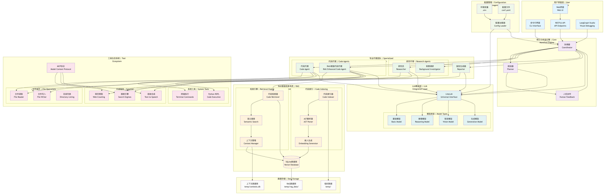

# DeepTool

[](https://www.python.org/downloads/)
[](https://opensource.org/licenses/MIT)

> Originated from Open Source, give back to Open Source.


## Quick Start

DeepTool is developed in Python, and comes with a web UI written in Node.js. To ensure a smooth setup process, we recommend using the following tools:

### Recommended Tools

- **[`uv`](https://docs.astral.sh/uv/getting-started/installation/):**
  Simplify Python environment and dependency management. `uv` automatically creates a virtual environment in the root directory and installs all required packages for you—no need to manually install Python environments.

- **[`nvm`](https://github.com/nvm-sh/nvm):**
  Manage multiple versions of the Node.js runtime effortlessly.

- **[`pnpm`](https://pnpm.io/installation):**
  Install and manage dependencies of Node.js project.

### Environment Requirements

Make sure your system meets the following minimum requirements:

- **[Python](https://www.python.org/downloads/):** Version `3.12+`
- **[Node.js](https://nodejs.org/en/download/):** Version `22+`

### Installation

```bash
# Clone the repository
git clone https://github.com/bytedance/deer-flow.git
cd deer-flow

# Install dependencies, uv will take care of the python interpreter and venv creation, and install the required packages
uv sync

# Configure .env with your API keys
# Tavily: https://app.tavily.com/home
# Brave_SEARCH: https://brave.com/search/api/
# volcengine TTS: Add your TTS credentials if you have them
cp .env.example .env

# See the 'Supported Search Engines' and 'Text-to-Speech Integration' sections below for all available options

# Configure conf.yaml for your LLM model and API keys
# Please refer to 'docs/configuration_guide.md' for more details
cp conf.yaml.example conf.yaml

# Install marp for ppt generation
# https://github.com/marp-team/marp-cli?tab=readme-ov-file#use-package-manager
brew install marp-cli
```

Optionally, install web UI dependencies via [pnpm](https://pnpm.io/installation):

```bash
cd deer-flow/web
pnpm install
```

### Configurations

Please refer to the [Configuration Guide](docs/configuration_guide.md) for more details.

> [!NOTE]
> Before you start the project, read the guide carefully, and update the configurations to match your specific settings and requirements.

### Console UI

The quickest way to run the project is to use the console UI.

```bash
# Run the project in a bash-like shell
uv run main.py
```

### Web UI

This project also includes a Web UI, offering a more dynamic and engaging interactive experience.

> [!NOTE]
> You need to install the dependencies of web UI first.

```bash
# Run both the backend and frontend servers in development mode
# On macOS/Linux
./bootstrap.sh -d

# On Windows
bootstrap.bat -d
```

Open your browser and visit [`http://localhost:3000`](http://localhost:3000) to explore the web UI.

Explore more details in the [`web`](./web/) directory.

## Supported Search Engines

DeerFlow supports multiple search engines that can be configured in your `.env` file using the `SEARCH_API` variable:

- **Tavily** (default): A specialized search API for AI applications

  - Requires `TAVILY_API_KEY` in your `.env` file
  - Sign up at: https://app.tavily.com/home

- **DuckDuckGo**: Privacy-focused search engine

  - No API key required

- **Brave Search**: Privacy-focused search engine with advanced features

  - Requires `BRAVE_SEARCH_API_KEY` in your `.env` file
  - Sign up at: https://brave.com/search/api/

- **Arxiv**: Scientific paper search for academic research
  - No API key required
  - Specialized for scientific and academic papers

To configure your preferred search engine, set the `SEARCH_API` variable in your `.env` file:

```bash
# Choose one: tavily, duckduckgo, brave_search, arxiv
SEARCH_API=tavily
```

## Features

### Core Capabilities

- 🤖 **LLM Integration**
  - It supports the integration of most models through [litellm](https://docs.litellm.ai/docs/providers).
  - Support for open source models like Qwen
  - OpenAI-compatible API interface
  - Multi-tier LLM system for different task complexities

### Tools and MCP Integrations

- 🔍 **Search and Retrieval**

  - Web search via Tavily, Brave Search and more
  - Crawling with Jina
  - Advanced content extraction

- 📃 **RAG Integration**

  - Supports mentioning files from [RAGFlow](https://github.com/infiniflow/ragflow) within the input box. [Start up RAGFlow server](https://ragflow.io/docs/dev/).

  ```bash
     # .env
     RAG_PROVIDER=ragflow
     RAGFLOW_API_URL="http://localhost:9388"
     RAGFLOW_API_KEY="ragflow-xxx"
     RAGFLOW_RETRIEVAL_SIZE=10
  ```

- 🔗 **MCP Seamless Integration**
  - Expand capabilities for private domain access, knowledge graph, web browsing and more
  - Facilitates integration of diverse research tools and methodologies

### Human Collaboration

- 🧠 **Human-in-the-loop**

  - Supports interactive modification of research plans using natural language
  - Supports auto-acceptance of research plans

- 📝 **Report Post-Editing**
  - Supports Notion-like block editing
  - Allows AI refinements, including AI-assisted polishing, sentence shortening, and expansion
  - Powered by [tiptap](https://tiptap.dev/)

### Content Creation

- 🎙️ **Podcast and Presentation Generation**
  - AI-powered podcast script generation and audio synthesis
  - Automated creation of simple PowerPoint presentations
  - Customizable templates for tailored content

## Architecture

DeerFlow implements a modular multi-agent system architecture designed for automated research and code analysis. The system is built on LangGraph, enabling a flexible state-based workflow where components communicate through a well-defined message passing system.



> See it live at [deerflow.tech](https://deerflow.tech/#multi-agent-architecture)

The system employs a streamlined workflow with the following components:

1. **Coordinator**: The entry point that manages the workflow lifecycle

   - Initiates the research process based on user input
   - Delegates tasks to the planner when appropriate
   - Acts as the primary interface between the user and the system

2. **Planner**: Strategic component for task decomposition and planning

   - Analyzes research objectives and creates structured execution plans
   - Determines if enough context is available or if more research is needed
   - Manages the research flow and decides when to generate the final report

3. **Research Team**: A collection of specialized agents that execute the plan:

   - **Researcher**: Conducts web searches and information gathering using tools like web search engines, crawling and even MCP services.
   - **Coder**: Handles code analysis, execution, and technical tasks using Python REPL tool.
     Each agent has access to specific tools optimized for their role and operates within the LangGraph framework

4. **Reporter**: Final stage processor for research outputs
   - Aggregates findings from the research team
   - Processes and structures the collected information
   - Generates comprehensive research reports

## Text-to-Speech Integration

DeerFlow now includes a Text-to-Speech (TTS) feature that allows you to convert research reports to speech. This feature uses the volcengine TTS API to generate high-quality audio from text. Features like speed, volume, and pitch are also customizable.

### Using the TTS API

You can access the TTS functionality through the `/api/tts` endpoint:

```bash
# Example API call using curl
curl --location 'http://localhost:8000/api/tts' \
--header 'Content-Type: application/json' \
--data '{
    "text": "This is a test of the text-to-speech functionality.",
    "speed_ratio": 1.0,
    "volume_ratio": 1.0,
    "pitch_ratio": 1.0
}' \
--output speech.mp3
```

## Development

### Testing

Run the test suite:

```bash
# Run all tests
make test

# Run specific test file
pytest tests/integration/test_workflow.py

# Run with coverage
make coverage
```

### Code Quality

```bash
# Run linting
make lint

# Format code
make format
```

### Debugging with LangGraph Studio

DeerFlow uses LangGraph for its workflow architecture. You can use LangGraph Studio to debug and visualize the workflow in real-time.

#### Running LangGraph Studio Locally

DeerFlow includes a `langgraph.json` configuration file that defines the graph structure and dependencies for the LangGraph Studio. This file points to the workflow graphs defined in the project and automatically loads environment variables from the `.env` file.

##### Mac

```bash
# Install uv package manager if you don't have it
curl -LsSf https://astral.sh/uv/install.sh | sh

# Install dependencies and start the LangGraph server
uvx --refresh --from "langgraph-cli[inmem]" --with-editable . --python 3.12 langgraph dev --allow-blocking
```

##### Windows / Linux

```bash
# Install dependencies
pip install -e .
pip install -U "langgraph-cli[inmem]"

# Start the LangGraph server
langgraph dev
```

After starting the LangGraph server, you'll see several URLs in the terminal:

- API: http://127.0.0.1:2024
- Studio UI: https://smith.langchain.com/studio/?baseUrl=http://127.0.0.1:2024
- API Docs: http://127.0.0.1:2024/docs

Open the Studio UI link in your browser to access the debugging interface.

#### Using LangGraph Studio

In the Studio UI, you can:

1. Visualize the workflow graph and see how components connect
2. Trace execution in real-time to see how data flows through the system
3. Inspect the state at each step of the workflow
4. Debug issues by examining inputs and outputs of each component
5. Provide feedback during the planning phase to refine research plans

When you submit a research topic in the Studio UI, you'll be able to see the entire workflow execution, including:

- The planning phase where the research plan is created
- The feedback loop where you can modify the plan
- The research and writing phases for each section
- The final report generation

### Enabling LangSmith Tracing

DeerFlow supports LangSmith tracing to help you debug and monitor your workflows. To enable LangSmith tracing:

1. Make sure your `.env` file has the following configurations (see `.env.example`):

   ```bash
   LANGSMITH_TRACING=true
   LANGSMITH_ENDPOINT="https://api.smith.langchain.com"
   LANGSMITH_API_KEY="xxx"
   LANGSMITH_PROJECT="xxx"
   ```

2. Start tracing and visualize the graph locally with LangSmith by running:
   ```bash
   langgraph dev
   ```

This will enable trace visualization in LangGraph Studio and send your traces to LangSmith for monitoring and analysis.

## Docker

You can also run this project with Docker.

First, you need read the [configuration](docs/configuration_guide.md) below. Make sure `.env`, `.conf.yaml` files are ready.

Second, to build a Docker image of your own web server:

```bash
docker build -t deer-flow-api .
```

Final, start up a docker container running the web server:

```bash
# Replace deer-flow-api-app with your preferred container name
docker run -d -t -p 8000:8000 --env-file .env --name deer-flow-api-app deer-flow-api

# stop the server
docker stop deer-flow-api-app
```

### Docker Compose (include both backend and frontend)

DeerFlow provides a docker-compose setup to easily run both the backend and frontend together:

```bash
# building docker image
docker compose build

# start the server
docker compose up
```
