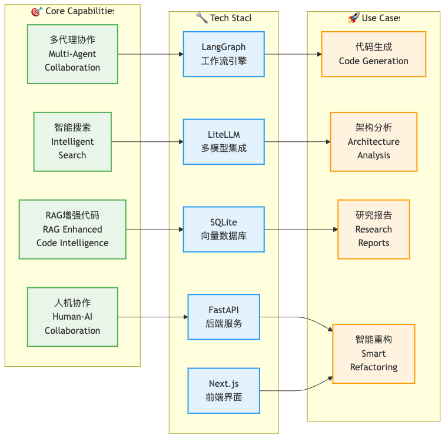

# DeepTool

[](https://www.python.org/downloads/)
[](https://opensource.org/licenses/MIT)

> Originated from Open Source, give back to Open Source.

An AI-powered research and code analysis platform built on multi-agent architecture, featuring RAG-enhanced intelligent code generation, semantic search, and context-aware planning.

### 🎯 Capabilities Overview



## ✨ Core Features

### 🤖 Multi-Agent Intelligence System
- **Coordinator**: Manages task decomposition and agent orchestration
- **Planner**: Creates detailed execution plans for complex tasks
- **Research Team**: Specialized information gathering and analysis
- **Code Agent**: Intelligent code generation and refactoring
- **Reporter**: Automated structured report generation

### 🧠 RAG-Enhanced Code Intelligence
- **🔍 Semantic Code Search**: Precise code retrieval based on AST parsing and embedding vectors
- **📊 Project Structure Understanding**: Intelligent analysis of dependencies and architectural patterns
- **🎯 Context-Aware Generation**: Generate consistent code based on existing patterns
- **🔄 Smart Refactoring Suggestions**: Optimization recommendations based on codebase analysis
- **📝 Automated Documentation**: Intelligent generation of API and architecture documentation

### 🔗 Powerful Tool Ecosystem
- **Web Search Integration**: Support for Tavily, Brave Search, DuckDuckGo, Arxiv
- **MCP Protocol Support**: Model Context Protocol for extensible tool integration
- **File System Operations**: Complete file read/write and directory management
- **Terminal Command Execution**: Secure system command execution environment
- **Python REPL**: Interactive code execution and validation

### 📱 Multiple Interface Support
- **Command Line Interface**: Quick task execution and debug mode
- **Web User Interface**: Modern interactive web application
- **LangGraph Studio**: Visual workflow debugging and monitoring
- **API Services**: RESTful API support for integration development

## 🚀 Quick Start

### 🔧 Environment Requirements

Make sure your system meets the following minimum requirements:
- **[Python](https://www.python.org/downloads/):** Version `3.12+`
- **[Node.js](https://nodejs.org/en/download/):** Version `22+` (Web UI only)

### 📦 Recommended Tools

- **[`uv`](https://docs.astral.sh/uv/getting-started/installation/):**
  Simplify Python environment and dependency management. `uv` automatically creates a virtual environment and installs all required packages.

- **[`nvm`](https://github.com/nvm-sh/nvm):**
  Effortlessly manage multiple Node.js runtime versions.

- **[`pnpm`](https://pnpm.io/installation):**
  Efficient Node.js project dependency management tool.

### 📥 Installation Steps

```bash
# Clone the repository
git clone https://github.com/cklxx/agent
cd agent

# Install dependencies, uv will handle Python interpreter and virtual environment creation
uv sync

# Configure environment variables and API keys
# Tavily Search: https://app.tavily.com/home
# Brave Search: https://brave.com/search/api/
# Volcengine TTS: Add TTS credentials if available
cp .env.example .env

# Configure LLM models and API keys
# For detailed configuration instructions, see 'docs/configuration_guide.md'
cp conf.yaml.example conf.yaml

# Install marp for PPT generation (optional)
# https://github.com/marp-team/marp-cli
brew install marp-cli
```

**Optional**: Install Web UI dependencies:

```bash
cd agent/web
pnpm install
```

### ⚙️ Configuration Guide

For detailed configuration instructions, please refer to the [Configuration Guide](docs/configuration_guide.md).

> [!NOTE]
> Before starting, please carefully read the configuration guide and update configurations according to your specific settings and requirements.

## 💻 Usage

### 🖥️ Console Interface

The quickest way to run the project is using the console interface:

```bash
# Run the project (simplified logging mode)
uv run main.py

# Run in debug mode (detailed logging output)
uv run main.py --debug
```

### 🔬 RAG Enhanced Code Agent CLI

Intelligent code generation and analysis CLI designed specifically for coding tasks:

```bash
# Quick start - execute coding tasks
./code_agent --task "Create HTTP client following existing patterns"

# Specify working directory and configuration file
./code_agent --task "Refactor user module" --working-directory /path/to/project --config custom_conf.yml

# Interactive mode for multiple tasks
uv run python scripts/rag_enhanced_code_agent_cli.py --interactive

# Debug mode for detailed execution logs
./code_agent --task "Add caching layer" --debug
```

#### 🧠 RAG Enhanced Features

- **🎯 Semantic Code Search**: Automatically retrieve relevant code patterns and implementations
- **📊 Context-Aware Planning**: Understand project structure and dependencies
- **🔄 Pattern Consistency**: Generate code that follows existing project patterns
- **💡 Intelligent Analysis**: Provide deep insights based on codebase knowledge

#### 📋 Logging Modes

The project supports two logging modes to balance clarity and detail:

- **Simplified Mode (Default)**: Clean output focusing on LLM planning and agent execution progress
- **Debug Mode**: Detailed logging for troubleshooting and development

See [Logging Guide](docs/logging_guide.md) for more details.

### 🌐 Web Interface

The project also includes a Web interface for a more dynamic and engaging interactive experience.

> [!NOTE]
> You need to install Web UI dependencies first.

```bash
# Run both backend and frontend servers in development mode
# macOS/Linux
./bootstrap.sh -d

# Windows
bootstrap.bat -d
```

Open your browser and visit [`http://localhost:3000`](http://localhost:3000) to experience the Web interface.

For more details, check the [`web`](./web/) directory.

## 🔍 Supported Search Engines

DeepTool supports multiple search engines that can be configured in your `.env` file using the `SEARCH_API` variable:

- **Tavily** (default): Specialized search API designed for AI applications
  - Requires `TAVILY_API_KEY` in your `.env` file
  - Sign up at: https://app.tavily.com/home

- **DuckDuckGo**: Privacy-focused search engine
  - No API key required

- **Brave Search**: Privacy-focused search engine with advanced features
  - Requires `BRAVE_SEARCH_API_KEY` in your `.env` file
  - Sign up at: https://brave.com/search/api/

- **Arxiv**: Scientific paper search for academic research
  - No API key required
  - Specialized for scientific and academic papers

Configuration example:
```bash
# Choose one: tavily, duckduckgo, brave_search, arxiv
SEARCH_API=tavily
```

## 🏗️ System Architecture

DeepTool employs a modular, LangGraph-based multi-agent system architecture for automated research and code analysis. Core components include a Coordinator, Planner, Research Team (with Researcher and Coder agents), and a Reporter, all working together in a flexible, state-based workflow.


**📊 Detailed Documentation**: 
- [System Architecture Document](docs/SYSTEM_ARCHITECTURE.md) - Technical architecture details
- [Complete Architecture Diagram](assets/architecture_detailed.md) - Visual architecture explanation

> See it live at [DeepTool.tech](https://DeepTool.tech/#multi-agent-architecture)

### 📊 Technology Stack

- **Core Framework**: LangGraph + LiteLLM
- **Backend**: Python 3.12+ + FastAPI
- **Frontend**: Next.js + React
- **Database**: SQLite (RAG vector storage)
- **Search**: Multi-search engine integration
- **Tool Integration**: MCP protocol support

## 🌟 Core Capabilities

### 🤖 LLM Integration
- Support for most models through [litellm](https://docs.litellm.ai/docs/providers)
- Support for open source models like Qwen
- OpenAI-compatible API interface
- Multi-tier LLM system for different task complexities

### 🔧 Tools and MCP Integrations

- **🔍 Search and Retrieval**
  - Web search via Tavily, Brave Search and more
  - Crawling with Jina
  - Advanced content extraction

- **📃 Intelligent RAG Integration**
  - 🧠 **Smart Code Indexing**: Supports gitignore rules, indexes only useful code files and configurations, reducing 50% of unnecessary files
  - 🎯 **Precise Code Retrieval**: Based on semantic search, quickly find relevant code snippets and implementation patterns
  - 📊 **Project Structure Understanding**: Intelligently analyze project dependencies and file relationships
  - Supports mentioning files from [RAGFlow](https://github.com/infiniflow/ragflow) within the input box. [Start up RAGFlow server](https://ragflow.io/docs/dev/).

  ```bash
     # .env
     RAG_PROVIDER=ragflow
     RAGFLOW_API_URL="http://localhost:9388"
     RAGFLOW_API_KEY="ragflow-xxx"
     RAGFLOW_RETRIEVAL_SIZE=10
  ```

- **🔗 Seamless MCP Integration**
  - Expand capabilities for private domain access, knowledge graphs, web browsing and more
  - Facilitate integration of diverse research tools and methodologies

### 🤝 Human Collaboration

- **🧠 Human-in-the-loop**
  - Support interactive modification of research plans using natural language
  - Support auto-acceptance of research plans

- **📝 Report Post-Editing**
  - Support Notion-like block editing
  - Allow AI refinements, including AI-assisted polishing, sentence shortening, and expansion
  - Powered by [tiptap](https://tiptap.dev/)

### 🎨 Content Creation

- **🎙️ Podcast and Presentation Generation**
  - AI-powered podcast script generation and audio synthesis
  - Automated creation of simple PowerPoint presentations
  - Customizable templates for tailored content

## 🎤 Text-to-Speech Integration

DeepTool now includes a Text-to-Speech (TTS) feature that allows you to convert research reports to speech. This feature uses the Volcengine TTS API to generate high-quality audio from text. Features like speed, volume, and pitch are also customizable.

### Using the TTS API

You can access the TTS functionality through the `/api/tts` endpoint:

```bash
# Example API call using curl
curl --location 'http://localhost:8000/api/tts' \
--header 'Content-Type: application/json' \
--data '{
    "text": "This is a test of the text-to-speech functionality.",
    "speed_ratio": 1.0,
    "volume_ratio": 1.0,
    "pitch_ratio": 1.0
}' \
--output speech.mp3
```

## 🔧 Development Guide

### 🧪 Testing

Run the test suite:

```bash
# Run all tests
make test

# Run specific test file
pytest tests/integration/test_workflow.py

# Run with coverage
make coverage
```

### 📏 Code Quality

```bash
# Run linting
make lint

# Format code
make format
```

### 🔍 Debugging with LangGraph Studio

DeepTool uses LangGraph for its workflow architecture. You can use LangGraph Studio to debug and visualize the workflow in real-time.

#### Running LangGraph Studio Locally

DeepTool includes a `langgraph.json` configuration file that defines the graph structure and dependencies for LangGraph Studio. This file points to the workflow graphs defined in the project and automatically loads environment variables from the `.env` file.

##### macOS

```bash
# Install uv package manager if you don't have it
curl -LsSf https://astral.sh/uv/install.sh | sh

# Install dependencies and start the LangGraph server
uvx --refresh --from "langgraph-cli[inmem]" --with-editable . --python 3.12 langgraph dev --allow-blocking
```

##### Windows / Linux

```bash
# Install dependencies
pip install -e .
pip install -U "langgraph-cli[inmem]"

# Start the LangGraph server
langgraph dev
```

After starting the LangGraph server, you'll see several URLs in the terminal:

- API: http://127.0.0.1:2024
- Studio UI: https://smith.langchain.com/studio/?baseUrl=http://127.0.0.1:2024
- API Docs: http://127.0.0.1:2024/docs

Open the Studio UI link in your browser to access the debugging interface.

#### Using LangGraph Studio

In the Studio UI, you can:

1. Visualize the workflow graph and see how components connect
2. Trace execution in real-time to see how data flows through the system
3. Inspect the state at each step of the workflow
4. Debug issues by examining inputs and outputs of each component
5. Provide feedback during the planning phase to refine research plans

When you submit a research topic in the Studio UI, you'll be able to see the entire workflow execution, including:

- The planning phase where the research plan is created
- The feedback loop where you can modify the plan
- The research and writing phases for each section
- The final report generation

### Enabling LangSmith Tracing

DeepTool supports LangSmith tracing to help you debug and monitor your workflows. To enable LangSmith tracing:

1. Make sure your `.env` file has the following configurations (see `.env.example`):

   ```bash
   LANGSMITH_TRACING=true
   LANGSMITH_ENDPOINT="https://api.smith.langchain.com"
   LANGSMITH_API_KEY="xxx"
   LANGSMITH_PROJECT="xxx"
   ```

2. Start tracing and visualize the graph locally with LangSmith by running:
   ```bash
   langgraph dev
   ```

This will enable trace visualization in LangGraph Studio and send your traces to LangSmith for monitoring and analysis.

## 🐳 Docker Deployment

You can also run this project with Docker.

First, you need to read the [configuration guide](docs/configuration_guide.md) below. Make sure `.env` and `conf.yaml` files are ready.

Second, build a Docker image of your own web server:

```bash
docker build -t agent-api .
```

Finally, start up a docker container running the web server:

```bash
# Replace agent-api-app with your preferred container name
docker run -d -t -p 8000:8000 --env-file .env --name agent-api-app agent-api

# Stop the server
docker stop agent-api-app
```

### Docker Compose (Backend and Frontend)

DeepTool provides a docker-compose setup to easily run both the backend and frontend together:

```bash
# Build docker image
docker compose build

# Start the server
docker compose up
```

## 📚 Documentation

- [Configuration Guide](docs/configuration_guide.md) - Detailed configuration instructions
- [System Architecture](docs/SYSTEM_ARCHITECTURE.md) - System architecture details
- [RAG Code Agent](docs/rag_enhanced_code_agent.md) - RAG enhanced code agent documentation
- [MCP Integrations](docs/mcp_integrations.md) - MCP protocol integration guide
- [Context Management](docs/context_management.md) - Context management mechanisms

## 🤝 Contributing

We welcome community contributions! Please check our contributing guidelines for more information.

## 📄 License

This project is licensed under the MIT License - see the [LICENSE](LICENSE) file for details.

## 🙏 Acknowledgments

Special thanks to all contributors and maintainers in the open source community whose work makes this project possible.

---

**Originated from Open Source, give back to Open Source**
