# DeepTool 系统架构详图

## 架构概览

DeepTool采用基于LangGraph的模块化多代理系统架构，集成RAG增强的智能代码分析和生成能力。

## 详细架构图

```mermaid
graph TB
    subgraph "用户界面层 | User Interface Layer"
        CLI[命令行界面<br/>CLI Interface]
        WEB[Web界面<br/>Web UI]
        API[RESTful API<br/>API Endpoints]
        STUDIO[LangGraph Studio<br/>Visual Debugging]
    end

    subgraph "核心工作流引擎 | Core Workflow Engine"
        COORD[协调器<br/>Coordinator]
        PLAN[规划器<br/>Planner]
        HUMAN[人机协作<br/>Human Feedback]
    end

    subgraph "专业代理团队 | Specialized Agent Team"
        subgraph "研究代理 | Research Agents"
            RESEARCH[研究员<br/>Researcher]
            BG[背景调研<br/>Background Investigator]
        end
        
        subgraph "代码代理 | Code Agents"
            CODE[代码代理<br/>Code Agent]
            RAG_CODE[RAG增强代码代理<br/>RAG Enhanced Code Agent]
        end
        
        REPORT[报告生成器<br/>Reporter]
    end

    subgraph "RAG智能检索系统 | RAG Intelligence System"
        subgraph "代码索引 | Code Indexing"
            INDEXER[代码索引器<br/>Code Indexer]
            AST[AST解析器<br/>AST Parser]
            EMBED[嵌入生成<br/>Embedding Generator]
        end
        
        subgraph "检索引擎 | Retrieval Engine"
            RETRIEVER[代码检索器<br/>Code Retriever]
            SEMANTIC[语义搜索<br/>Semantic Search]
            CONTEXT[上下文管理<br/>Context Manager]
        end
        
        DB[(SQLite数据库<br/>Vector Database)]
    end

    subgraph "工具生态系统 | Tool Ecosystem"
        subgraph "文件操作 | File Operations"
            READ[文件读取<br/>File Reader]
            WRITE[文件写入<br/>File Writer]
            LIST[目录列表<br/>Directory Listing]
        end
        
        subgraph "系统工具 | System Tools"
            TERM[终端执行<br/>Terminal Commands]
            PYTHON[Python REPL<br/>Code Execution]
        end
        
        subgraph "外部服务 | External Services"
            SEARCH[搜索引擎<br/>Search Engines]
            CRAWL[网页爬取<br/>Web Crawling]
            TTS[语音合成<br/>Text-to-Speech]
        end
        
        MCP[MCP协议<br/>Model Context Protocol]
    end

    subgraph "LLM集成层 | LLM Integration Layer"
        LITE[LiteLLM<br/>Universal Interface]
        
        subgraph "模型类型 | Model Types"
            BASIC[基础模型<br/>Basic Model]
            REASON[推理模型<br/>Reasoning Model]
            VISION[视觉模型<br/>Vision Model]
            GEN[生成模型<br/>Generation Model]
        end
    end

    subgraph "配置管理 | Configuration Management"
        ENV[环境变量<br/>.env]
        CONF[配置文件<br/>conf.yaml]
        CONFIG[配置加载器<br/>Config Loader]
    end

    subgraph "数据存储 | Data Storage"
        TEMP[临时数据<br/>temp/]
        RAG_DATA[RAG数据库<br/>temp/rag_data/]
        CONTEXT_DB[上下文数据库<br/>temp/contexts.db]
    end

    %% 用户界面连接
    CLI --> COORD
    WEB --> API
    API --> COORD
    STUDIO --> COORD

    %% 核心工作流
    COORD --> PLAN
    PLAN --> HUMAN
    HUMAN --> COORD
    COORD --> RESEARCH
    COORD --> BG
    COORD --> CODE
    COORD --> RAG_CODE
    COORD --> REPORT

    %% RAG系统连接
    RAG_CODE --> RETRIEVER
    RETRIEVER --> SEMANTIC
    SEMANTIC --> CONTEXT
    INDEXER --> AST
    AST --> EMBED
    EMBED --> DB
    RETRIEVER --> DB
    CONTEXT --> DB

    %% 代理工具使用
    CODE --> READ
    CODE --> WRITE
    CODE --> TERM
    RAG_CODE --> READ
    RAG_CODE --> WRITE
    RAG_CODE --> PYTHON
    RESEARCH --> SEARCH
    RESEARCH --> CRAWL
    BG --> SEARCH
    REPORT --> TTS

    %% LLM集成
    COORD --> LITE
    PLAN --> LITE
    RESEARCH --> LITE
    CODE --> LITE
    RAG_CODE --> LITE
    REPORT --> LITE
    LITE --> BASIC
    LITE --> REASON
    LITE --> VISION
    LITE --> GEN

    %% 配置管理
    ENV --> CONFIG
    CONF --> CONFIG
    CONFIG --> LITE
    CONFIG --> COORD

    %% 数据存储
    DB --> RAG_DATA
    CONTEXT --> CONTEXT_DB
    INDEXER --> TEMP

    %% MCP集成
    MCP --> SEARCH
    MCP --> CRAWL
    MCP --> TTS

    classDef userInterface fill:#e1f5fe
    classDef workflow fill:#f3e5f5
    classDef agents fill:#e8f5e8
    classDef rag fill:#fff3e0
    classDef tools fill:#fce4ec
    classDef llm fill:#e0f2f1
    classDef config fill:#f1f8e9
    classDef storage fill:#fafafa

    class CLI,WEB,API,STUDIO userInterface
    class COORD,PLAN,HUMAN workflow
    class RESEARCH,BG,CODE,RAG_CODE,REPORT agents
    class INDEXER,AST,EMBED,RETRIEVER,SEMANTIC,CONTEXT,DB rag
    class READ,WRITE,LIST,TERM,PYTHON,SEARCH,CRAWL,TTS,MCP tools
    class LITE,BASIC,REASON,VISION,GEN llm
    class ENV,CONF,CONFIG config
    class TEMP,RAG_DATA,CONTEXT_DB storage
```

## 核心组件说明

### 🔵 用户界面层 (User Interface Layer)
- **CLI Interface**: 命令行界面，提供快速任务执行
- **Web UI**: 现代化Web界面，基于Next.js + React
- **RESTful API**: 标准化API接口，支持集成开发
- **LangGraph Studio**: 可视化调试和工作流监控

### 🟣 核心工作流引擎 (Core Workflow Engine)
- **Coordinator**: 任务协调器，负责任务分解和代理调度
- **Planner**: 智能规划器，制定详细的执行计划
- **Human Feedback**: 人机协作节点，支持计划修改和反馈

### 🟢 专业代理团队 (Specialized Agent Team)
- **Researcher**: 专业研究员，负责信息收集和分析
- **Background Investigator**: 背景调研员，深度信息挖掘
- **Code Agent**: 基础代码代理，处理代码生成任务
- **RAG Enhanced Code Agent**: RAG增强代码代理，上下文感知的智能代码生成
- **Reporter**: 报告生成器，自动生成结构化报告

### 🟠 RAG智能检索系统 (RAG Intelligence System)
- **Code Indexer**: 智能代码索引器，支持gitignore规则
- **AST Parser**: 抽象语法树解析器，精确代码结构分析
- **Embedding Generator**: 向量嵌入生成器
- **Code Retriever**: 代码检索器，语义搜索相关代码
- **Semantic Search**: 语义搜索引擎
- **Context Manager**: 上下文管理器，维护代码上下文
- **Vector Database**: SQLite向量数据库，存储代码嵌入

### 🟡 工具生态系统 (Tool Ecosystem)
- **文件操作**: 读取、写入、列表等文件系统操作
- **系统工具**: 终端命令执行、Python REPL
- **外部服务**: 多搜索引擎、网页爬取、语音合成
- **MCP协议**: 模型上下文协议，可扩展工具集成

### 🔰 LLM集成层 (LLM Integration Layer)
- **LiteLLM**: 统一的LLM接口，支持多种模型提供商
- **分层模型**: 基础、推理、视觉、生成等不同类型模型

### 🌱 配置管理 (Configuration Management)
- **环境变量**: .env文件管理敏感配置
- **配置文件**: conf.yaml管理应用配置
- **配置加载器**: 统一配置加载和验证

### ⚫ 数据存储 (Data Storage)
- **临时数据**: temp目录存储临时文件
- **RAG数据库**: temp/rag_data/存储向量数据
- **上下文数据库**: temp/contexts.db存储上下文信息

## 数据流程

1. **用户请求** → 通过CLI/Web/API进入系统
2. **任务协调** → Coordinator分析任务类型和复杂度
3. **智能规划** → Planner制定详细执行计划
4. **人机协作** → 可选的人工反馈和计划调整
5. **代理执行** → 根据任务类型调用相应专业代理
6. **RAG增强** → 代码任务自动检索相关上下文
7. **工具调用** → 代理使用工具完成具体操作
8. **结果整合** → Reporter生成最终输出
9. **多格式输出** → 支持文本、语音、文档等多种格式

## 核心优势

- **🧠 智能化**: RAG增强的上下文感知能力
- **🔄 灵活性**: 模块化设计，易于扩展和定制
- **🎯 专业性**: 针对不同任务类型的专业代理
- **🤝 协作性**: 人机协作，支持交互式优化
- **🔧 工具丰富**: 完整的工具生态系统
- **📊 可视化**: LangGraph Studio提供直观的调试体验 