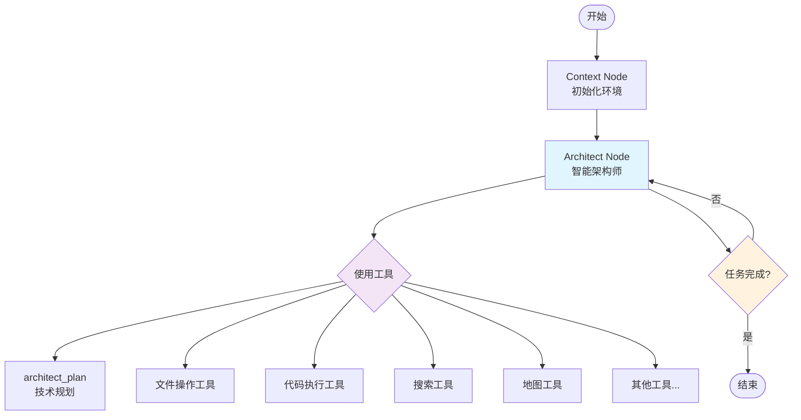

# Architect Agent 架构文档

## 概述

全新的 Architect Agent 架构将原本复杂的多节点工作流简化为一个强大的智能架构师节点，该节点能够：

1. **自我递归调用** - 处理复杂任务时可以多次调用自己
2. **使用所有工具** - 集成了文件操作、代码执行、搜索、地图等所有可用工具
3. **智能规划** - 通过 `architect_plan` 工具生成详细的技术实施计划
4. **迭代执行** - 支持多轮迭代优化，直到完成任务

## 架构图



## 核心组件

### 1. Context Node
- **功能**: 初始化运行环境和上下文信息
- **职责**: 
  - 设置工作目录信息
  - 初始化 RAG 上下文
  - 配置迭代限制
- **流向**: `START` → `context` → `architect_node`

### 2. Architect Node
- **功能**: 核心智能执行节点
- **职责**:
  - 分析用户任务
  - 调用 `architect_plan` 生成执行计划
  - 使用各种工具执行具体任务
  - 监控执行进度和质量
  - 决定是否需要继续迭代或结束
- **流向**: `architect_node` → `architect_node` (递归) 或 `__end__`

## 可用工具集

### 🏗️ 架构规划工具
- `architect_plan`: 分析技术需求并生成实施计划

### 🤖 代理调度工具
- `dispatch_agent`: 调用专门的代理进行复杂分析

### 📁 文件操作工具
- `view_file`: 查看文件内容
- `list_files`: 列出目录文件
- `glob_search`: 按模式搜索文件
- `grep_search`: 搜索文件内容
- `edit_file`: 编辑文件
- `replace_file`: 替换文件内容

### 💻 代码执行工具
- `python_repl_tool`: 执行Python代码
- `bash_command`: 执行bash命令

### 🔍 搜索和网络工具
- `get_web_search_tool`: 网络搜索
- `crawl_tool`: 网页内容抓取
- `get_retriever_tool`: RAG检索

### 🗺️ 地图工具
- `search_location`: 搜索位置
- `get_route`: 获取路线
- `get_nearby_places`: 获取附近地点

### 📓 笔记本工具
- `notebook_read`: 读取Jupyter笔记本
- `notebook_edit_cell`: 编辑笔记本单元格

### 💬 对话管理工具
- `clear_conversation`: 清空对话历史
- `compact_conversation`: 压缩对话历史

### 🧠 思考工具
- `think`: 记录思考过程

## 工作流程

### 标准执行流程

1. **初始化阶段** (Context Node)
   ```
   启动 → 环境初始化 → 上下文设置 → 转向架构师
   ```

2. **分析阶段** (Architect Node - 第1次迭代)
   ```
   接收任务 → think工具分析 → architect_plan规划 → 制定执行策略
   ```

3. **执行阶段** (Architect Node - 后续迭代)
   ```
   使用文件工具 → 使用代码工具 → 使用搜索工具 → 验证结果 → 评估完成度
   ```

4. **迭代优化** (根据需要)
   ```
   检查质量 → 发现问题 → 重新规划 → 继续执行 → 直到满意
   ```

5. **结束阶段**
   ```
   生成最终报告 → 标记任务完成 → 流程结束
   ```

### 递归调用机制

```python
# 伪代码示例
def architect_node(state):
    iteration = state.get('iteration_count', 0)
    
    if iteration >= MAX_ITERATIONS:
        return finish_with_report()
    
    # 分析当前任务
    analysis = think_about_task()
    
    # 生成或优化计划
    plan = architect_plan(task, context)
    
    # 执行计划中的步骤
    results = execute_plan_steps(plan)
    
    # 评估结果
    if task_completed_satisfactorily(results):
        return finish_with_report(results)
    else:
        return continue_iteration(updated_context)
```

## 与旧架构对比

### 旧架构 (多节点)
```
Context → Coordinator → Planner → Team → [Researcher/Coder] → Reporter → End
```
- **优点**: 职责分离清晰
- **缺点**: 流程复杂，节点间通信开销大，难以处理复杂迭代需求

### 新架构 (单节点递归)
```
Context → Architect (可递归) → End
```
- **优点**: 
  - 流程简洁，响应迅速
  - 强大的递归能力，适合复杂任务
  - 工具集中管理，功能更强大
  - 减少状态传递复杂性
- **缺点**: 
  - 单节点责任较重
  - 需要更智能的内部逻辑

## 配置说明

### LLM 配置
```python
# src/config/agents.py
AGENT_LLM_MAP = {
    "architect": "reasoning",  # 使用推理模型
}
```

### 迭代控制
```python
# 在状态中设置
state = {
    "iteration_count": 0,
    "max_iterations": 10,  # 最大迭代次数
}
```

## 使用示例

### 基本用法
```python
from src.code.graph.builder import build_graph

# 构建图
graph = build_graph()

# 准备输入
initial_state = {
    "messages": [{"role": "user", "content": "创建一个Python计算器"}],
    "locale": "zh-CN",
}

# 执行
async for state in graph.astream(initial_state, config):
    # 处理每一步的输出
    print(state)
```

### 复杂任务示例
```python
# 复杂的代码重构任务
task = """
分析当前项目的代码结构，找出可以优化的地方，
然后重构代码以提高可维护性和性能。
请生成详细的重构计划并执行。
"""

# Architect Agent 会:
# 1. 使用 think 工具分析任务
# 2. 使用 architect_plan 制定重构计划
# 3. 使用 list_files、view_file 分析现有代码
# 4. 使用 grep_search 查找代码模式
# 5. 使用 edit_file 实施重构
# 6. 使用 python_repl_tool 验证修改
# 7. 根据需要进行多轮迭代优化
```

## 最佳实践

### 1. 任务描述
- 提供清晰、具体的任务描述
- 包含预期的输出格式和质量要求
- 指明特殊约束或限制

### 2. 迭代控制
- 根据任务复杂度设置合适的最大迭代次数
- 复杂任务建议设置较高的迭代限制

### 3. 工具组合
- Architect Agent 会智能选择合适的工具组合
- 用户无需指定具体工具，只需描述需求

### 4. 质量控制
- Agent 内置质量检查机制
- 支持自动重试和优化

## 故障排除

### 常见问题

1. **迭代次数不足**
   - 增加 `max_iterations` 设置
   - 检查任务复杂度是否超出预期

2. **工具调用失败**
   - 检查环境变量和API密钥配置
   - 确认所需工具的依赖已安装

3. **无限递归**
   - 设置合理的迭代限制
   - 改进任务描述的明确性

### 调试技巧

1. **启用详细日志**
   ```python
   import logging
   logging.basicConfig(level=logging.DEBUG)
   ```

2. **监控迭代过程**
   ```python
   async for state in graph.astream(initial_state, config):
       iteration = state.get('iteration_count', 0)
       print(f"当前迭代: {iteration}")
   ```

3. **检查工具使用情况**
   - 查看日志中的工具调用记录
   - 分析是否选择了合适的工具

## 扩展和定制

### 添加新工具
1. 在 `src/tools/` 目录下创建新工具
2. 在 `src/code/graph/nodes.py` 的 `ALL_TOOLS` 列表中添加
3. 更新 prompt 模板中的工具说明

### 修改迭代逻辑
- 编辑 `architect_node` 函数中的迭代控制逻辑
- 调整完成判断条件

### 自定义 Prompt
- 修改 `src/prompts/architect_agent.md`
- 添加特定领域的指导原则

## 总结

新的 Architect Agent 架构通过以下创新实现了更强大的功能：

1. **统一智能节点**: 将多个专业节点的能力集中到一个智能架构师节点
2. **递归执行能力**: 支持复杂任务的多轮迭代优化
3. **全工具集成**: 一个节点即可使用所有可用工具
4. **智能规划**: 通过 architect_plan 工具提供专业的技术规划能力

这种架构特别适合处理复杂的编程任务、系统分析、和需要多步骤执行的技术问题。 